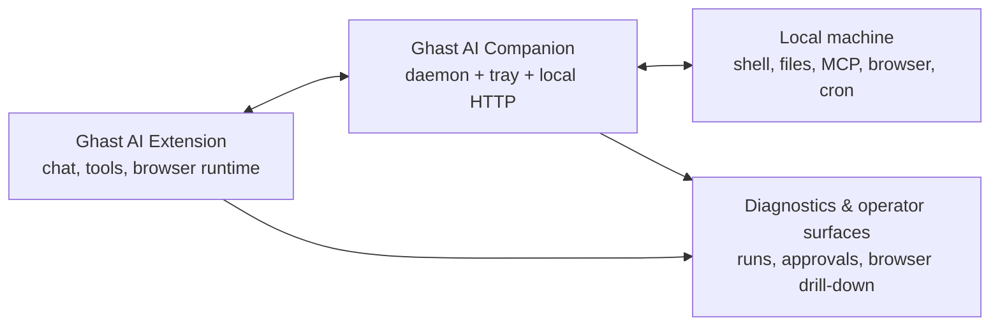

<p align="center">
  
</p>

<h1 align="center">Ghast AI Companion</h1>

<p align="center">
  <strong>The desktop runtime for <a href="https://github.com/Trapezohe/trapezohe_extension">Ghast AI</a>.</strong>
  <br />
  Shipped in this repository as <code>trapezohe-companion</code>, it auto-pairs locally, unlocks trusted desktop capabilities, hosts MCP tools, and provides the runtime backbone behind browser automation, diagnostics, and local agent workflows.
</p>

<p align="center">
  macOS installer (.pkg) &nbsp;•&nbsp; Windows installer (.msi) &nbsp;•&nbsp; Linux / developer setup via CLI
</p>

---

## Why Companion exists

A browser extension alone cannot safely expose local files, shell execution, native browser pairing, or long-running desktop services.

Ghast AI Companion is the local process that closes that gap. It runs on your machine, binds to `127.0.0.1`, protects access with a local token, and works with the Ghast AI extension to provide:

- local command execution with permission-policy controls
- local file and MCP-backed tool access
- Chromium native-host pairing for Chrome, Brave, Chromium, and Edge
- browser runtime support, event ledgers, and drill-down diagnostics for operator tooling
- ACP session ingress, approval flow, and run tracking
- self-check, repair, media normalization, and memory checkpoint shadow support

## What it powers

| Area | What you get |
| --- | --- |
| Desktop pairing | The extension can discover and trust a local companion automatically through native messaging. |
| Local runtime | Shell commands, long-running sessions, stdin / send-keys flows, and permission-policy enforcement. |
| MCP host | A local MCP bridge that can host filesystem, search, database, and custom tool servers. |
| Browser runtime backbone | Session/action/artifact ledgers, event tails, and drill-down APIs for browser automation debugging. |
| Agent ingress | ACP sessions, approvals, run ledger links, and operator-facing runtime metadata. |
| Reliability | Diagnostics, self-check, repair loops, media normalization, and follower-only memory shadow freshness. |

## Architecture at a glance



## Install

### Recommended: installer packages

Download the latest release from:

- [Latest release](https://github.com/Trapezohe/companion_service/releases/latest)

| Platform | Package | Notes |
| --- | --- | --- |
| macOS | `trapezohe-companion-macos.pkg` | Installs the daemon and tray app together |
| Windows | `trapezohe-companion-windows.msi` | Installs the daemon and tray app together |
| Linux | CLI / script install | No packaged desktop installer yet |

The desktop tray panel is installed together with the daemon in the packaged desktop installers.

The macOS installer is signed and notarized in official GitHub releases. The Windows installer may still trigger SmartScreen until Windows code signing is added. Verify the release source and `SHA256SUMS.txt` before proceeding.

### Script / CLI install

For Linux, development environments, or manual setup flows:

**macOS / Linux**

```bash
curl -fsSL https://raw.githubusercontent.com/Trapezohe/companion_service/main/install.sh | bash
```

Non-interactive workspace-scoped setup:

```bash
curl -fsSL https://raw.githubusercontent.com/Trapezohe/companion_service/main/install.sh | bash -s -- --non-interactive --mode workspace --workspace ~/trapezohe-workspace
```

**Windows (PowerShell)**

```powershell
irm https://raw.githubusercontent.com/Trapezohe/companion_service/main/install.ps1 | iex
```

Non-interactive workspace-scoped setup:

```powershell
irm https://raw.githubusercontent.com/Trapezohe/companion_service/main/install.ps1 | iex -- --non-interactive --mode workspace --workspace "$HOME\\trapezohe-workspace"
```

### npm install

```bash
npm install -g trapezohe-companion
trapezohe-companion bootstrap --mode workspace --workspace ~/trapezohe-workspace
```

`bootstrap` creates config, registers the native host, and starts the local daemon in one flow.

## Pairing with the extension

For ordinary users, the intended flow is simple:

1. Install the desktop companion
2. Open the tray app or keep the daemon running
3. Open the Ghast AI extension and go to `Settings -> Companion`
4. Click the status check / connection check flow

When native-host registration is healthy, pairing should be automatic.

If you need the manual fallback path:

1. Start the service: `trapezohe-companion start`
2. Print the token: `trapezohe-companion token`
3. In the extension's Companion page, enter `http://127.0.0.1:41591`
4. Paste the token and save

## Configuration

Companion stores local state under `~/.trapezohe/` by default.

Important files:

- config: `~/.trapezohe/companion.json`
- PID file: `~/.trapezohe/companion.pid`
- native-host manifests: browser-specific native messaging directories

Example config:

```json
{
  "port": 41591,
  "token": "your-access-token",
  "permissionPolicy": {
    "mode": "workspace",
    "workspaceRoots": ["/Users/me/trapezohe-workspace"]
  },
  "mcpServers": {
    "filesystem": {
      "command": "npx",
      "args": ["-y", "@modelcontextprotocol/server-filesystem", "/Users/me/documents"]
    }
  }
}
```

### Permission policy

- `workspace` - recommended for development and controlled local execution
- `full` - no workspace boundary restriction for the current OS user

## CLI quick reference

```bash
trapezohe-companion start
trapezohe-companion start -d
trapezohe-companion stop
trapezohe-companion stop --force
trapezohe-companion status
trapezohe-companion init
trapezohe-companion token
trapezohe-companion policy
trapezohe-companion policy workspace ~/trapezohe-workspace
trapezohe-companion self-check --json
trapezohe-companion repair repair_config
trapezohe-companion repair register_native_host
trapezohe-companion bootstrap --mode workspace --workspace ~/trapezohe-workspace
```

## Core HTTP surfaces

All HTTP endpoints are local-only and require `Authorization: Bearer <token>`.

| Surface | Purpose |
| --- | --- |
| `/healthz` | Liveness, version, and basic runtime state |
| `/api/system/capabilities` | Protocol version and supported feature flags |
| `/api/system/diagnostics` | Companion health, browser ledger state, memory shadow, and MCP/runtime summaries |
| `/api/system/self-check` | Repair-oriented health checks |
| `/api/runtime/*` | Exec, session lifecycle, logs, stdin, send-keys, run ledger, approvals |
| `/api/mcp/*` | MCP server inventory and tool invocation |
| `/api/browser/*` | Browser sessions, actions, artifacts, events, and drill-down routes |
| `/api/acp/*` | ACP session ingress and event transport |
| `/api/cron/*` | Pending occurrence replay and cron bookkeeping |
| `/api/memory-shadow/*` | Mirrored checkpoint shadow status and refresh hooks |

If you need the exact contract, read the source of `src/server.mjs`, `src/browser-routes.mjs`, and `src/acp-routes.mjs`.

## Diagnostics and repair

Companion includes a built-in self-check and a lightweight repair loop for the most common local failures.

```bash
trapezohe-companion self-check
trapezohe-companion self-check --json
trapezohe-companion repair repair_config
trapezohe-companion repair register_native_host
```

These checks cover config integrity, token availability, native-host registration, workspace policy, and configured MCP executable readiness.

## Development

```bash
npm install
npm test
node bin/cli.mjs --help
cargo test --manifest-path tray/Cargo.toml --locked
npm run build:installer:macos
npm run build:installer:windows
```

Useful local outputs:

- macOS package: `dist/installers/trapezohe-companion-macos.pkg`
- Windows MSI: `dist/installers/trapezohe-companion-windows.msi`

### GitHub release signing inputs

The `Auto Release Companion Installers` workflow now treats signed + notarized macOS releases as the default path. If any required secret is missing, the macOS release job now fails instead of quietly producing an unsigned package. Set these repository secrets before relying on GitHub auto-publish:

- `APPLE_ID`
- `APPLE_TEAM_ID`
- `APPLE_APP_SPECIFIC_PASSWORD`
- `APPLE_DEVELOPER_ID_APP_P12_BASE64`
- `APPLE_DEVELOPER_ID_APP_P12_PASSWORD`
- `APPLE_DEVELOPER_ID_INSTALLER_P12_BASE64`
- `APPLE_DEVELOPER_ID_INSTALLER_P12_PASSWORD`
- `TAURI_SIGNING_PRIVATE_KEY`
- `TAURI_SIGNING_PRIVATE_KEY_PASSWORD`

Optional only if you want to override the identity names detected from the imported `.p12` certificates:

- `APPLE_DEVELOPER_ID_APP_IDENTITY`
- `APPLE_DEVELOPER_ID_INSTALLER_IDENTITY`

On GitHub Actions, the workflow validates these secrets first, imports both Developer ID certificates into a temporary keychain, detects the certificate identity names, writes a temporary signing env file, builds the signed `.pkg`, notarizes it, verifies the signed artifacts, then signs the macOS updater archive with the Tauri updater key.

## Notes for advanced operators

The public product surface should stay simple, but the companion also exposes deeper operator and diagnostics capabilities used by the extension during debugging and reliability workflows, including:

- browser ledger links between sessions, actions, artifacts, and events
- drill-down routes for recent browser activity
- runtime run / approval ledgers for ACP and local exec flows
- checkpoint shadow freshness and mirrored recovery state

Those advanced surfaces are intentionally secondary to the ordinary install-and-connect flow.
